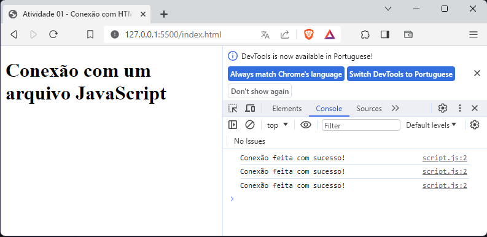

# JavaScript I - Aula 03
## 📄 Atividade 01 - Conexão com HTML 
Aluno: Cleverson Guandalin

---
# Conexão com um arquivo JavaScript

Criar um projeto web simples para demonstrar a conexão entre um arquivo HTML e um arquivo JavaScript. O arquivo HTML possuindo um título  "Conexão com um arquivo JavaScript", e o arquivo JavaScript contendo uma função que exibia a mensagem "Conexão feita com sucesso!" no terminal. Conectar os arquivos, abrir o projeto no navegador com a extensão LiveServer e verificar se a mensagem era exibida corretamente no terminal.


## Código desenvolvido html:
    
```html
<!DOCTYPE html>
<html lang="en">
  <head>
    <meta charset="UTF-8" />
    <meta name="viewport" content="width=device-width, initial-scale=1.0" />
    <script src="script.js" defer></script>
    <title>Atividade 01 - Conexão com HTML</title>
  </head>
  <body>
    <h1>Conexão com um arquivo JavaScript</h1>
  </body>
</html>
```


## Código desenvolvido JavaScript:
    
```javascript
function imprimirMensagem() {
  console.log('Conexão feita com sucesso!')
}

imprimirMensagem()
imprimirMensagem()
imprimirMensagem()

```
## Resultado no navegador:




---
