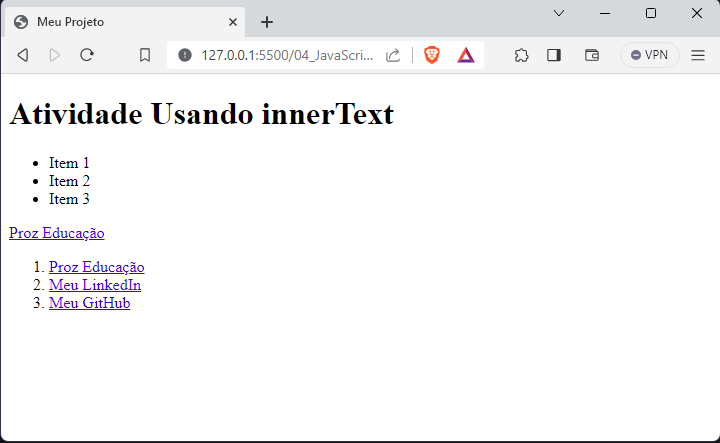

# JavaScript I - Aula 05
## 📄 Atividade 01 - InnerText e InnerHTML 
Aluno: Cleverson Guandalin

---
# Usando innerText e innerHTML para adicionar conteúdo a elementos HTML

Nessa atividade, o objetivo é criar um projeto web com um arquivo HTML e um arquivo JavaScript. No HTML, devemos adicionar elementos vazios, como h1, ul, a e ol, com atributos específicos. No JavaScript, iremos conectar os arquivos, capturar os elementos do HTML e adicionar conteúdo a eles usando propriedades como .innerText e .innerHTML. Ao abrir o projeto no navegador, poderemos verificar se o conteúdo foi adicionado corretamente aos elementos do HTML.


## Código desenvolvido html:
    
```html
<!DOCTYPE html>
<html>
  <head>
    <title>Meu Projeto</title>
  </head>
  <body>
    <h1 id="titulo"></h1>
    <ul></ul>
    <a href="https://prozeducacao.com.br"></a>
    <ol id="lista-ordenada"></ol>
    <script src="script.js"></script>
  </body>
</html>
```


## Código desenvolvido JavaScript:
    
```javascript
const titulo = document.getElementById('titulo')
titulo.innerText = 'Atividade Usando innerText'

const link = document.querySelector('a')
link.innerText = 'Proz Educação'

const listaNaoOrdenada = document.querySelector('ul')
listaNaoOrdenada.innerHTML = '<li>Item 1</li><li>Item 2</li><li>Item 3</li>'

const listaOrdenada = document.getElementById('lista-ordenada')
listaOrdenada.innerHTML =
  "<li><a href='https://prozeducacao.com.br'>Proz Educação</a></li><li><a href='https://www.linkedin.com/in/cleversonguandalin/'>Meu LinkedIn</a></li><li><a href='https://github.com/CleverGnd'>Meu GitHub</a></li>"

```
## Resultado no navegador:




---
