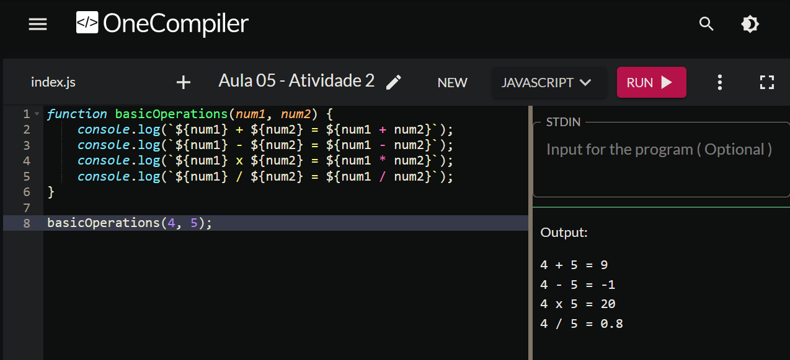

# JavaScript I - Aula 05
## 📄 Atividade 02 - Template Strings 
Aluno: Cleverson Guandalin

---
# Usando Template Strings

A atividade consiste em acessar o site OneCompiler e criar uma função que recebe dois números como parâmetros. A função deve imprimir no terminal quatro frases utilizando template strings, representando as quatro operações básicas (adição, subtração, multiplicação e divisão) aplicadas aos números fornecidos. Cada frase deve mostrar a operação realizada e o resultado obtido.

## Código desenvolvido JavaScript:
    
```javascript
function basicOperations(num1, num2) {
    console.log(`${num1} + ${num2} = ${num1 + num2}`);
    console.log(`${num1} - ${num2} = ${num1 - num2}`);
    console.log(`${num1} x ${num2} = ${num1 * num2}`);
    console.log(`${num1} / ${num2} = ${num1 / num2}`);
}

basicOperations(4, 5);

```
## Resultado no OneCompiler:




---
